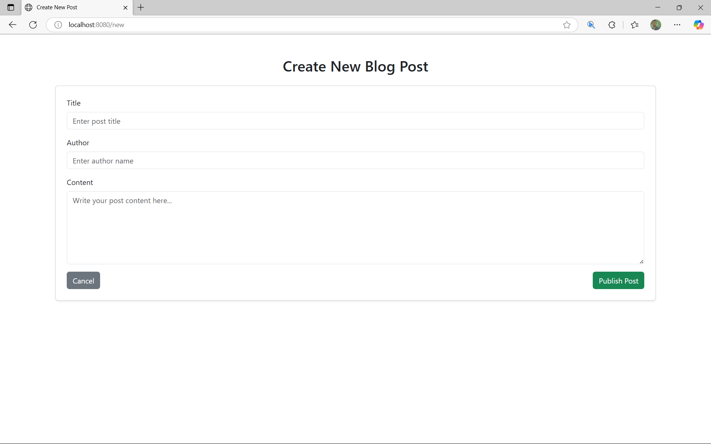
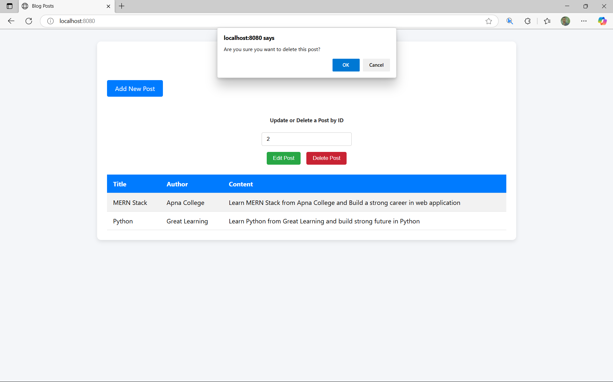
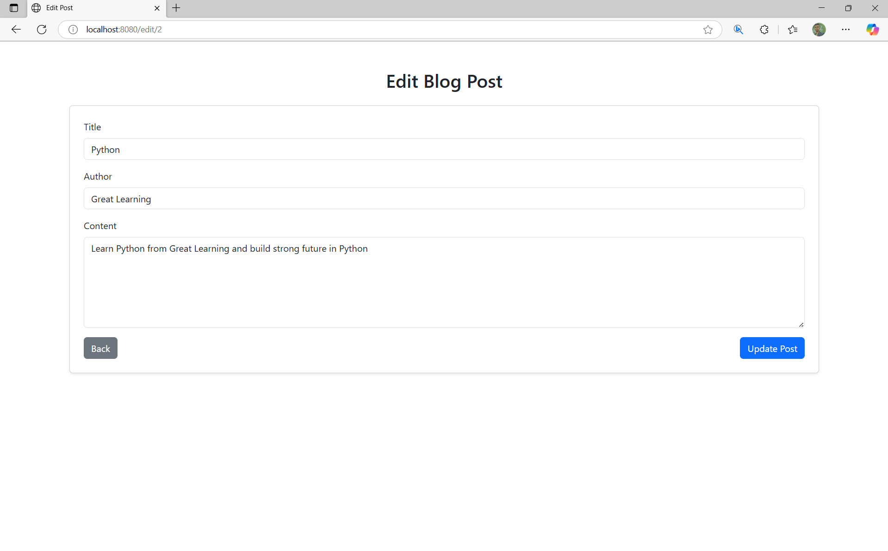

# 📝 Blog Post Web Application

This is a simple **Spring Boot CRUD (Create, Read, Update, Delete)** web application for managing blog posts. Users can add, view, edit, and delete blog posts using a clean and responsive interface.

---

## 🚀 Features

- ✅ Add new blog posts (Title, Author, Content)
- 📄 Display all blog posts in a styled table
- ✏️ Edit existing blog posts
- ❌ Delete posts using post ID
- 📦 Spring Boot with Thymeleaf for view rendering
- 💾 Data persistence using Spring Data JPA

---

## 🔧 Technologies Used

- Java (Spring Boot)
- Spring MVC + Thymeleaf
- Spring Data JPA + Hibernate
- HTML/CSS (Bootstrap UI)
- H2/any SQL database

---

## 📷 UI Screenshots

### 🏠 Home Page – View All Posts
Displays all saved blog posts in a tabular format.


---

### ➕ Create New Blog Post
A form to add a new blog post with title, author, and content.



---

### ❌ Confirm Delete
Confirmation popup before deleting a post by ID.



---

### 🛠️ Edit Blog Post
Edit and update an existing post.



---

## 🗂️ Folder Structure

├── src
│ └── main
│ ├── java
│ │ └── com.blog.Blogging.Project
│ │ ├── controller
│ │ ├── model
│ │ └── repository
│ └── resources
│ ├── templates
│ └── application.properties
├── images
│ ├── home.png
│ ├── new_post.png
│ ├── delete.png
│ └── edit_post.png
└── README.md

---

## 📦 How to Run

1. Clone the repo:
   ```bash
   git clone https://github.com/your-username/blog-post-app.git
   cd blog-post-app

2. Open the project in IntelliJ / Eclipse / VS Code

3. Run the Spring Boot application:
mvn spring-boot:run

4. Visit:
http://localhost:8080/

👨‍💻 Author
Sagar Satyarthi Mishra
LinkedIn: @sagar-satyarthi-mishra

📃 License
This project is open source and available under the MIT License.
